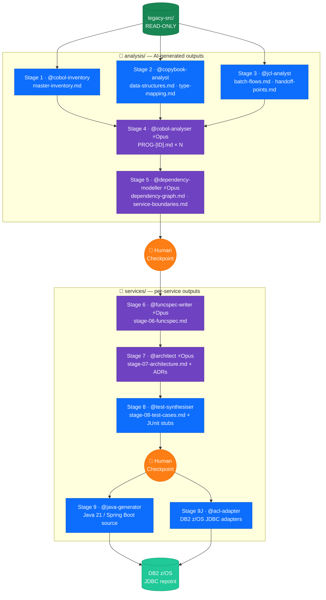

# mainframe-mod-agents

AI-assisted mainframe modernisation framework — migrating COBOL/CICS/JCL workloads on IBM z/OS to Java 21 / Spring Boot 3.x microservices using GitHub Copilot custom agents.

---

## Repository Structure

```
mainframe-mod-agents/
├── sample-mainframe-app/              ← AWS CardDemo — full-stack mainframe sample (READ-ONLY reference)
└── MF_Mod/                             ← MF App modernisation PoC
    ├── .github/                        ← All Copilot customisation files
    │   ├── copilot-instructions.md     ← Auto-loaded global instructions
    │   ├── AGENTS.md                   ← Background agent instructions
    │   ├── agents/                     ← 10 custom agent definitions (Stages 1–9)
    │   ├── instructions/               ← Stage-scoped instruction files
    │   ├── prompts/                    ← Reusable prompt templates (PROMPT-01 to 09)
    │   └── chatmodes/                  ← Persistent chat personas
    ├── legacy-src/                     ← READ-ONLY mainframe source artefacts
    ├── analysis/                       ← AI-generated analysis outputs (Stages 1–5)
    ├── services/                       ← Generated Java source + docs (Stages 6–9)
    ├── governance/                     ← RACI, risk register, ADRs, PoC plan
    └── ops/                            ← Pipeline state, CI workflows
```

---

## Sample Mainframe Application

[`sample-mainframe-app/`](sample-mainframe-app/) contains the **AWS CardDemo** — a complete, open-source (Apache 2.0) mainframe credit card application used as the test corpus for the MF App modernisation pipeline.

| Artefact | Folder | Count |
|----------|--------|-------|
| COBOL programs (CICS online + batch) | `app/cbl/` | 31 |
| Copybooks | `app/cpy/` | 30 |
| BMS screen maps | `app/bms/` | 17 |
| JCL members | `app/jcl/` | 38 |
| DB2 DDL | `app/app-transaction-type-db2/ddl/` | ✓ |
| DB2 DCLGEN declarations | `app/app-transaction-type-db2/dcl/` | ✓ |
| Assembler utilities | `app/asm/` | ✓ |
| Sample data (ASCII + EBCDIC) | `app/data/` | ✓ |

**Variants included:**
- `app/` — core VSAM-based application
- `app/app-transaction-type-db2/` — DB2 variant (replaces VSAM with DB2 tables)
- `app/app-authorization-ims-db2-mq/` — IMS + DB2 + MQ variant

> This folder is READ-ONLY reference material. Copy relevant artefacts into `op-newloan-poc/legacy-src/` before running agents.

Source: [github.com/aws-samples/aws-mainframe-modernization-carddemo](https://github.com/aws-samples/aws-mainframe-modernization-carddemo)

---

## PoC Scope

**Programme**: MF App
**Source stack**: COBOL (CICS online + batch), Copybooks, DCLGENs, JCL, DB2 z/OS
**Target stack**: Java 21 / Spring Boot 3.x — retaining DB2 z/OS via JDBC repoint (no data migration)

**Services in scope**:
- `loan-origination-service`
- `loan-assessment-service`
- `loan-document-service`

---

## 9-Stage Pipeline



> 🔵 **Sonnet** — inventory, analysis, test & code generation &nbsp;|&nbsp; 🟣 **Opus** — deep analysis, dependency modelling, spec & architecture &nbsp;|&nbsp; 🟠 **Checkpoint** — human approval required before proceeding

| Stage | Agent | Model | Output |
|-------|-------|-------|--------|
| 1 | `@cobol-inventory` | Sonnet | `analysis/stage-01/master-inventory.md` |
| 2 | `@copybook-analyst` | Sonnet | `analysis/stage-02/` (data structures, type mapping) |
| 3 | `@jcl-analyst` | Sonnet | `analysis/stage-03/` (batch flows, handoff points) |
| 4 | `@cobol-analyser` | **Opus** | `analysis/stage-04/PROG-[ID].md` × N |
| 5 | `@dependency-modeller` | **Opus** | `analysis/stage-05/` (dependency graph, service boundaries) |
| 6 | `@funcspec-writer` | **Opus** | `services/*/stage-06-funcspec.md` |
| 7 | `@architect` | **Opus** | `services/*/stage-07-architecture.md` + ADRs |
| 8 | `@test-synthesiser` | Sonnet | `services/*/stage-08-test-cases.md` + JUnit stubs |
| 9 | `@java-generator` + `@acl-adapter` | Sonnet | `services/*/src/` (Java + DB2 adapters) |

---

## Getting Started

### Prerequisites
- GitHub Copilot Enterprise (for custom agents and chat modes)
- Access to IBM DB2 z/OS JDBC credentials (for Stage 9 integration testing)
- Java 21, Maven 3.9+

### Running a Stage

1. Open Copilot Chat in VS Code
2. Reference the relevant prompt template:
   ```
   #file:.github/prompts/PROMPT-01-Artifact-Inventory.md
   ```
3. Invoke the agent:
   ```
   @cobol-inventory analyse legacy-src/ and produce the master inventory
   ```
4. Review the output in `analysis/stage-01/master-inventory.md`
5. Update `ops/pipeline-state.json` after human sign-off

### Using Chat Modes
- **COBOL analysis work**: switch to the `cobol-analyst` chat mode
- **Architecture decisions**: switch to the `java-architect` chat mode

---

## Key Conventions

| Rule | Detail |
|------|--------|
| `legacy-src/` is READ-ONLY | Agents must never modify source artefacts |
| Human checkpoints | Required before Stages 6 and 9 write to `services/` |
| Monetary types | Always `BigDecimal` — never `double` or `float` |
| DB2 access | Spring Data JDBC only — no JPA/Hibernate |
| Commit format | `[STAGE-NN] agent-name: description` |

---

## Governance

| Document | Location |
|----------|---------|
| RACI Matrix | [governance/RACI.md](op-newloan-poc/governance/RACI.md) |
| Risk Register | [governance/risk-register.md](op-newloan-poc/governance/risk-register.md) |
| Assumptions | [governance/assumptions.md](op-newloan-poc/governance/assumptions.md) |
| 12-Week PoC Plan | [governance/poc-plan.md](op-newloan-poc/governance/poc-plan.md) |
| Architecture Decision Records | [governance/adr/](op-newloan-poc/governance/adr/) |
| Pipeline State | [ops/pipeline-state.json](op-newloan-poc/ops/pipeline-state.json) |
| Progress Log | [analysis/progress.md](op-newloan-poc/analysis/progress.md) |
